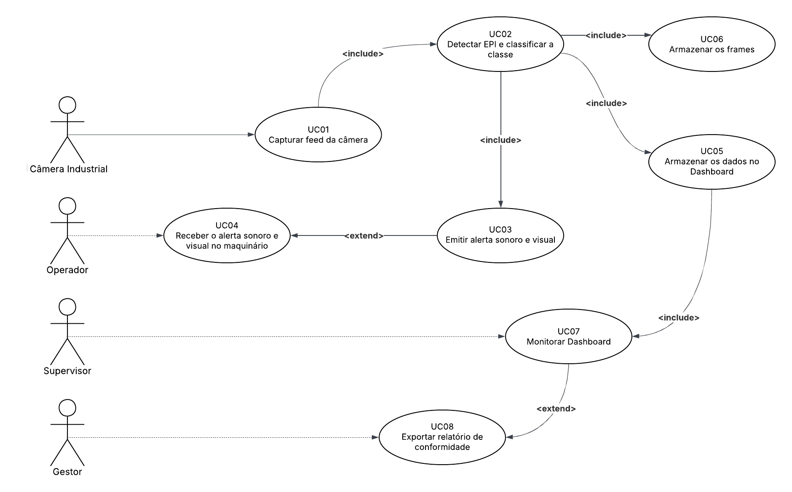

# 🎭 Diagrama de Casos de Uso — SafeVision

> Os atores e casos de uso foram definidos a partir dos requisitos funcionais e das personas levantadas no [documento de requisitos](../REQUISITOS.md).

---

## Descrição dos Atores

| Ator | Descrição |
|---|---|
| **Câmera Industrial** | Ator externo (sistema); fornece o feed de vídeo ao sistema de detecção |
| **Operador de Chão de Fábrica** | Usuário monitorado; interage indiretamente via alertas em campo |
| **Supervisor de Segurança** | Usuário principal do dashboard; valida alertas e consulta histórico |
| **Gestor Industrial** | Acessa relatórios gerenciais e KPIs de conformidade |

---

## Diagrama

---

## Descrição dos Casos de Uso Principais

### UC02 — Detectar Uso de EPI
- **Ator principal:** Câmera Industrial
- **Pré-condição:** Câmera ativa e conectada ao sistema
- **Fluxo principal:** O sistema captura o frame → aplica o modelo YOLOv8 → classifica cada trabalhador detectado no frame
- **Pós-condição:** Cada trabalhador recebe classificação "Em Conformidade" ou "Em Risco"
- **Include:** UC01 (Capturar Feed da Câmera), UC05 (Armazenar os dados no Dashboard), UC06 (Armazenar os frames), UC03 (Emitir alerta sonoro e visual)

### UC04 — Receber o alerta sonoro e visual no maquinário
- **Ator principal:** Operador
- **Pré-condição:** Detecção de não conformidade com confiança ≥ 80%
- **Fluxo principal:** Sistema dispara alerta → sinais sonoros e visuais no maquinário → borda do player da câmera afetada muda para vermelho
- **Extend:** UC03 (Emitir alerta sonoro e visual)

### UC08 — Exportar Relatório de Conformidade
- **Ator principal:** Gestor Industrial
- **Pré-condição:** Usuário autenticado com perfil Gestor
- **Fluxo principal:** Sistema consulta logs → gera relatório com taxa de conformidade
- **Extend:** UC07 (Monitorar Dashboard)
