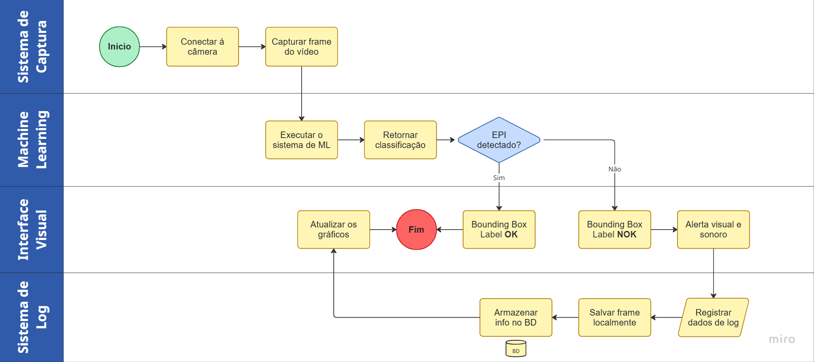

# 🔄 Diagrama de Atividades

> Funcionalidade modelada: **Sistema de Captura ➡ Machine Learning ➡ Interface Visual ➡ Sistema de Logs** 

---

## Diagrama

---

## Descrição do Fluxo

### Fluxo Principal (Conformidade
1. O sistema inicializa a conexão com todas as câmeras configuradas.
2. Frames são capturados continuamente de cada câmera.
3. Cada frame é pré-processado e submetido à inferência do modelo YOLOv8.
4. As detecções com confiança ≥ 80% são processadas.
5. **Se o trabalhador está com EPI:** bounding box verde é exibida; fluxo retorna à captura.
6. **Se o trabalhador está sem EPI e o cooldown não está ativo:**
   - Alerta visual e sonoro são disparados imediatamente.
   - O frame é capturado e salvo como evidência.
   - O incidente é registrado no banco de dados.
   - O supervisor recebe o alerta e pode validar.

### Fluxos Alternativos
- **Câmera offline:** sistema registra a falha, emite alerta de câmera indisponível no dashboard e continua monitorando as demais câmeras.
- **Baixa confiança:** frames com nenhuma detecção acima de 80% são descartados sem gerar log.
- **Cooldown ativo:** novas detecções na mesma câmera dentro da janela de 30s não geram alertas adicionais (evita flood de notificações).

---

## Rastreabilidade com Requisitos

| Etapa do Fluxo | Requisitos Cobertos |
|---|---|
| Captura de frames | RF-01, RNF-01, RNF-04 |
| Inferência YOLOv8 | RF-02, RF-04, RNF-01 |
| Bounding box verde/vermelho | RF-03 |
| Cooldown | RF-06 |
| Alerta visual | RF-07, RF-08, RNF-03 |
| Alerta sonoro | RF-09 |
| Captura de evidência | RF-12 |
| Registro no BD | RF-11, RF-13, RNF-06 |
| Validação pelo supervisor | RF-10 |
