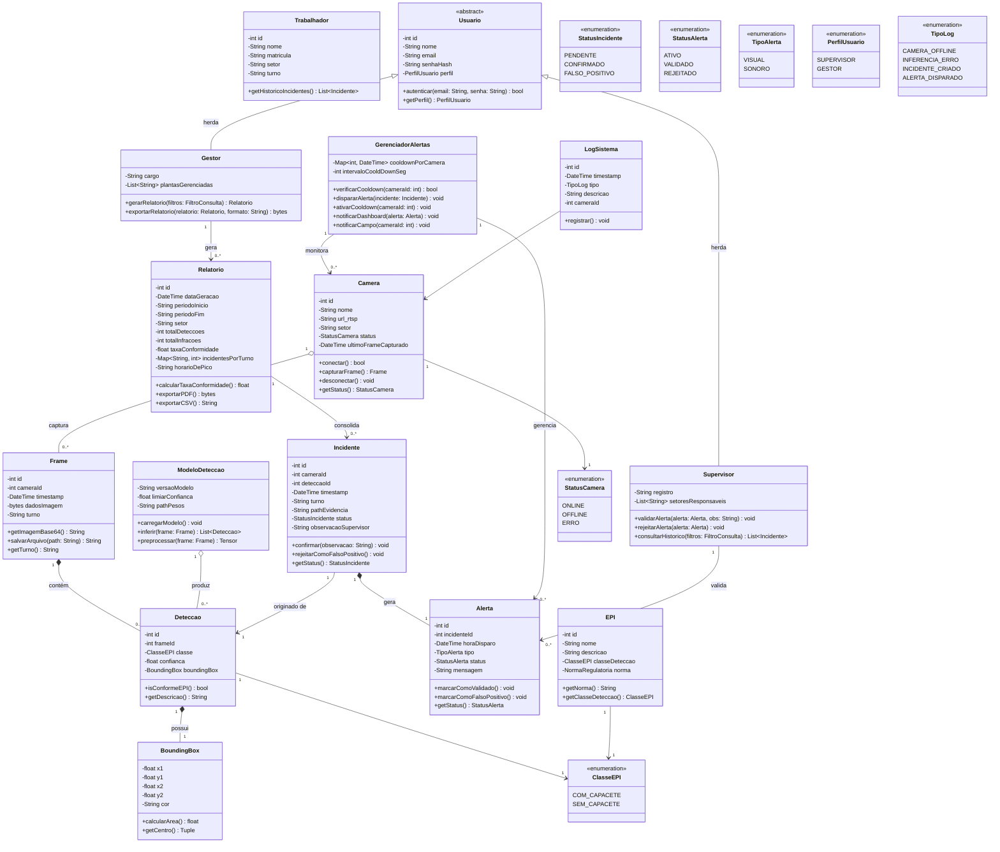

# 🧩 Diagrama de Classes — SafeVision

> As classes modeladas suportam diretamente os casos de uso e o fluxo de atividades descritos nos diagramas anteriores.

---

## Diagrama

```mermaid
classDiagram
    direction TB

    %% ─────────────────────────────────────────
    %% MÓDULO DE CAPTURA E INFERÊNCIA
    %% ─────────────────────────────────────────

    class Camera {
        -int id
        -String nome
        -String url_rtsp
        -String setor
        -StatusCamera status
        -DateTime ultimoFrameCapturado
        +conectar() bool
        +capturarFrame() Frame
        +desconectar() void
        +getStatus() StatusCamera
    }

    class Frame {
        -int id
        -int cameraId
        -DateTime timestamp
        -bytes dadosImagem
        -String turno
        +getImagemBase64() String
        +salvarArquivo(path: String) String
        +getTurno() String
    }

    class ModeloDeteccao {
        -String versaoModelo
        -float limiarConfianca
        -String pathPesos
        +carregarModelo() void
        +inferir(frame: Frame) List~Deteccao~
        +preprocessar(frame: Frame) Tensor
    }

    class Deteccao {
        -int id
        -int frameId
        -ClasseEPI classe
        -float confianca
        -BoundingBox boundingBox
        +isConformeEPI() bool
        +getDescricao() String
    }

    class BoundingBox {
        -float x1
        -float y1
        -float x2
        -float y2
        -String cor
        +calcularArea() float
        +getCentro() Tuple
    }

    %% ─────────────────────────────────────────
    %% MÓDULO DE ALERTAS
    %% ─────────────────────────────────────────

    class GerenciadorAlertas {
        -Map~int, DateTime~ cooldownPorCamera
        -int intervaloCooldDownSeg
        +verificarCooldown(cameraId: int) bool
        +dispararAlerta(incidente: Incidente) void
        +ativarCooldown(cameraId: int) void
        +notificarDashboard(alerta: Alerta) void
        +notificarCampo(cameraId: int) void
    }

    class Alerta {
        -int id
        -int incidenteId
        -DateTime horaDisparo
        -TipoAlerta tipo
        -StatusAlerta status
        -String mensagem
        +marcarComoValidado() void
        +marcarComoFalsoPositivo() void
        +getStatus() StatusAlerta
    }

    %% ─────────────────────────────────────────
    %% MÓDULO DE DOMÍNIO
    %% ─────────────────────────────────────────

    class Incidente {
        -int id
        -int cameraId
        -int deteccaoId
        -DateTime timestamp
        -String turno
        -String pathEvidencia
        -StatusIncidente status
        -String observacaoSupervisor
        +confirmar(observacao: String) void
        +rejeitarComoFalsoPositivo() void
        +getStatus() StatusIncidente
    }

    class EPI {
        -int id
        -String nome
        -String descricao
        -ClasseEPI classeDeteccao
        -NormaRegulatoria norma
        +getNorma() String
        +getClasseDeteccao() ClasseEPI
    }

    class Trabalhador {
        -int id
        -String nome
        -String matricula
        -String setor
        -String turno
        +getHistoricoIncidentes() List~Incidente~
    }

    %% ─────────────────────────────────────────
    %% MÓDULO DE USUÁRIOS
    %% ─────────────────────────────────────────

    class Usuario {
        <<abstract>>
        -int id
        -String nome
        -String email
        -String senhaHash
        -PerfilUsuario perfil
        +autenticar(email: String, senha: String) bool
        +getPerfil() PerfilUsuario
    }

    class Supervisor {
        -String registro
        -List~String~ setoresResponsaveis
        +validarAlerta(alerta: Alerta, obs: String) void
        +rejeitarAlerta(alerta: Alerta) void
        +consultarHistorico(filtros: FiltroConsulta) List~Incidente~
    }

    class Gestor {
        -String cargo
        -List~String~ plantasGerenciadas
        +gerarRelatorio(filtros: FiltroConsulta) Relatorio
        +exportarRelatorio(relatorio: Relatorio, formato: String) bytes
    }

    %% ─────────────────────────────────────────
    %% MÓDULO DE RELATÓRIOS
    %% ─────────────────────────────────────────

    class Relatorio {
        -int id
        -DateTime dataGeracao
        -String periodoInicio
        -String periodoFim
        -String setor
        -int totalDeteccoes
        -int totalInfracoes
        -float taxaConformidade
        -Map~String, int~ incidentesPorTurno
        -String horarioDePico
        +calcularTaxaConformidade() float
        +exportarPDF() bytes
        +exportarCSV() String
    }

    class LogSistema {
        -int id
        -DateTime timestamp
        -TipoLog tipo
        -String descricao
        -int cameraId
        +registrar() void
    }

    %% ─────────────────────────────────────────
    %% ENUMERAÇÕES
    %% ─────────────────────────────────────────

    class ClasseEPI {
        <<enumeration>>
        COM_CAPACETE
        SEM_CAPACETE
    }

    class StatusCamera {
        <<enumeration>>
        ONLINE
        OFFLINE
        ERRO
    }

    class StatusIncidente {
        <<enumeration>>
        PENDENTE
        CONFIRMADO
        FALSO_POSITIVO
    }

    class StatusAlerta {
        <<enumeration>>
        ATIVO
        VALIDADO
        REJEITADO
    }

    class TipoAlerta {
        <<enumeration>>
        VISUAL
        SONORO
    }

    class PerfilUsuario {
        <<enumeration>>
        SUPERVISOR
        GESTOR
    }

    class TipoLog {
        <<enumeration>>
        CAMERA_OFFLINE
        INFERENCIA_ERRO
        INCIDENTE_CRIADO
        ALERTA_DISPARADO
    }

    %% ─────────────────────────────────────────
    %% RELACIONAMENTOS
    %% ─────────────────────────────────────────

    %% Herança
    Usuario <|-- Supervisor : herda
    Usuario <|-- Gestor : herda

    %% Composição
    Frame "1" *-- "0..*" Deteccao : contém
    Deteccao "1" *-- "1" BoundingBox : possui
    Incidente "1" *-- "1" Alerta : gera

    %% Agregação
    Camera "1" o-- "0..*" Frame : captura
    ModeloDeteccao "1" o-- "0..*" Deteccao : produz

    %% Associação
    Camera "1" --> "1" StatusCamera
    Deteccao "1" --> "1" ClasseEPI
    Incidente "1" --> "1" Deteccao : originado de
    GerenciadorAlertas "1" --> "0..*" Alerta : gerencia
    GerenciadorAlertas "1" --> "0..*" Camera : monitora
    Supervisor "1" --> "0..*" Alerta : valida
    Gestor "1" --> "0..*" Relatorio : gera
    Relatorio "1" --> "0..*" Incidente : consolida
    EPI "1" --> "1" ClasseEPI
    LogSistema --> Camera
```

---
